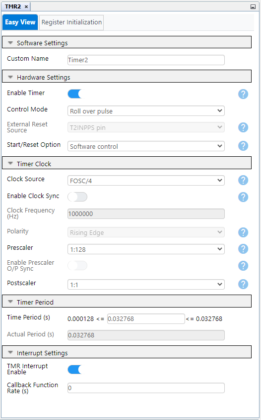
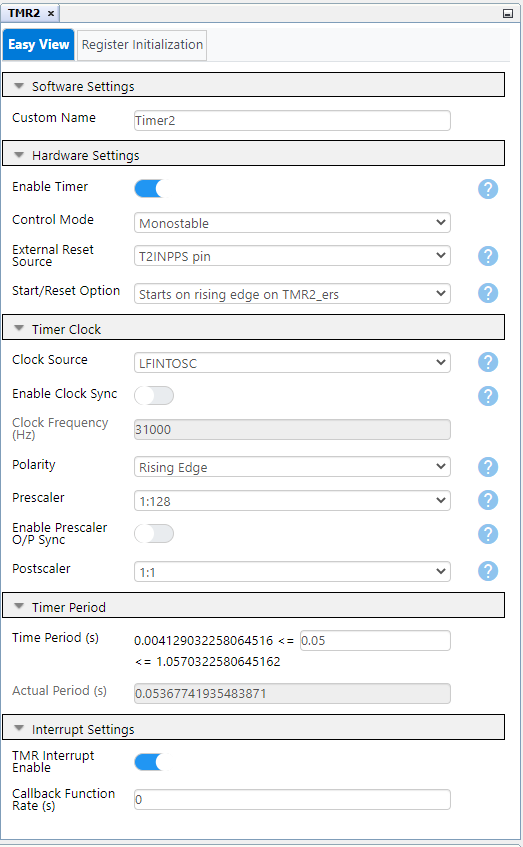
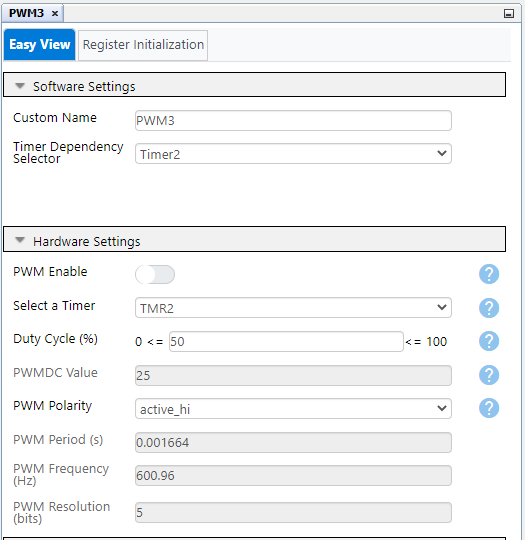
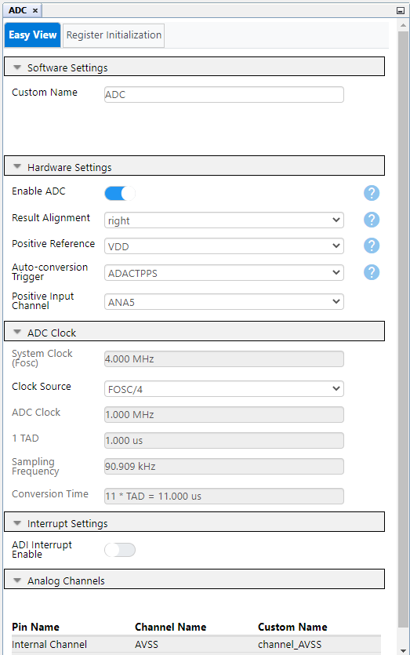
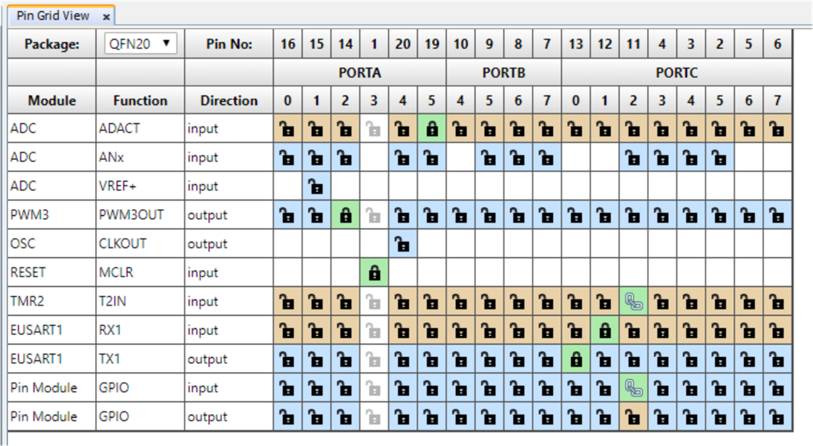

<!-- Please do not change this logo with link -->

# Sensor Data Measurement using PIC16F15244 Microcontroller

This example demonstrates sensor data measurement(i.e. acquiring and processing sensor raw data using built in ADC and timer peripherals of the PIC microcontroller.

## Introduction

The PIC16F152xx family of microcontrollers are equipped with Analog-to-Digital (ADC) with 10-bit resolution and option to provide up to 28 external and 2 internal channels, 8-bit Timer with Hardware Limit Timer and 2 Capture/Compare/PWM (CCP) modules with 10-bit resolution Pulse Width Modulation (PWM) mode and Enhanced Universal Synchronous Asynchronous Receiver Transmitter(EUSART). This example describes the implementation of sensor (alcohol sensor) data measurement using ADC peripheral of PIC16F15244 MCU. EUSART peripheral is used to display the test results on the terminal window. On performing the sensor data measurement(alcohol detection), the result is compared with the threshold values. PWM is used to enable the buzzer along with the result on terminal window if presence of alcohol is detected.

## Related Links

- [PIC16F15244 Product Page](https://www.microchip.com/wwwproducts/en/PIC16F15244 "PIC16F15244 Product Page")
- [PIC16F15244 Code Examples on GitHub](https://github.com/microchip-pic-avr-examples "PIC16F15244 Code Examples on GitHub")
- [PIC16F152xx MCU Family Video](https://youtu.be/nHLv3Th-o-s "PIC16F15244 MCU Family Video")
- [PIC16F152xx MCU Product Family Page](https://www.microchip.com/en-us/products/microcontrollers-and-microprocessors/8-bit-mcus/pic-mcus/pic16f15244 "PIC16F15244 Product Family Page")
- [TB3250 - Using PWM to Generate an Analog Output](https://ww1.microchip.com/downloads/en/Appnotes/90003250A.pdf "TB3250 - Using PWM to Generate an Analog Output")

## Description

In real time applications, ADC is required to convert the analog sensor data to digital value and analyze the data readings. Most of the environmental parameters such as temperature, sound, pressure, light, gas levels etc. are measurable in analog form only. In the alcohol detection system, analog signal from the alcohol sensor is acquired using ADC and analyzed for alcohol presence.

  
   Figure 1: System Block Diagram  

* In this example, PIC16F15244 curiosity nano board, Alcohol Click and Buzz 2 Click from MikroElektronika are used for demonstrating sensor data measurement using ADC peripheral. 
* MCU sleep feature is used to demonstrate low power usage. 
* The switch is required to be pressed for starting the ADC Measurement. The HLT mode of the timer is used for switch debouncing. 
* The data from sensor is acquired in terms of analog values, which is then compared with the threshold values. If the sensor output detected exceed the threshold value, then alcohol presence is detected. 
* The results of the test are displayed on the terminal window, along with buzzer indication using PWM. After completing the cycle, MCU enters sleep mode again.

## Alcohol Detection

Alcohol click has a high sensitivity to alcohol and it can be used to detect alcohol in concentrations from 0.04 to 4mg/l. Alcohol click carries an MQ-3 Semiconductor sensor for alcohol. The gas sensing layer on the sensor unit is made of Tin dioxide (SnO2), an inorganic compound which has lower conductivity in clean air. The conductivity increases as the levels of alcohol gas rise. Alcohol click has a small potentiometer that allows to adjust the load resistance of the sensor circuit.

The alcohol click communicates with the microcontroller through the AN pin. The input is provided to the internal ADC of MCU. The data acquired from the sensor is compared with the threshold levels. If the analog signal from alcohol click is above threshold, then alcohol presence is detected.

  
   Figure 2: Alcohol Click  

The buzzer is used as an indicator for alcohol detection. PWM is required to turn on the buzzer for indication. The timer 2 is used for addressing two different functionalities, for implementing switch debounce and as a time base for PWM.

  
   Figure 3: Buzz 2 Click  

## Software Used

Microchip’s free IDE, compiler and graphical code generators are used throughout the application firmware development. Following are the tools used for this demo application:

* MPLAB® X IDE [v6.10.0 or newer](https://www.microchip.com/mplab/mplab-x-ide)
* XC8 Compiler [v2.41.0 or newer](https://www.microchip.com/mplab/compilers)
* MPLAB Code Configurator (MCC) [v5.3.7](https://www.microchip.com/mplab/mplab-code-configurator)
* TMR2 MCC Melody Driver 4.0.16
* EUSART MCC Melody Driver 7.1.4
* PWM MCC Melody Driver 4.2.10
* ADC MCC Melody Driver 3.0.10
* Microchip PIC16F1xxxx Series Device Support [1.19.363 or newer](https://packs.download.microchip.com/)

***Note: For running the demo, the installed tool versions should be the same or later. This example is not tested with the previous versions.***

## Hardware Used

* [PIC16F15244 Curiosity Nano](https://www.microchip.com/en-us/product/PIC16F15244)
* [Curiosity Nano Base for Click boards](https://www.microchip.com/developmenttools/ProductDetails/AC164162)
* [Alcohol Click](https://www.mikroe.com/alcohol-click)
* [Buzz 2 Click](https://www.mikroe.com/buzz-2-click)

## Hardware Setup

The following figure consists of Alcohol Click, Buzz 2 Click, Curiosity Nano Adapter Board and PIC16F15244 Curiosity Nano Evaluation kit. The figure shows the detailed information about the hardware setup. The alcohol click and buzz 2 click are interfaced with PIC16F15244 MCU using curiosity nano adapter slot 1 and 2 respectively.

  
   Figure 4: Hardware Setup  

MQ-3 sensor and the click board with pot for adjustable resistance is visible from the below image.

  
   Figure 5: MQ-3 Sensor & Click Board  

## Operation

* Make the hardware connections as shown in the Hardware Setup. Power up the Curiosity Nano board using micro-USB cable.
* Download the firmware available from the github page link.
* Build the project using latest version of tools as mentioned in the Software Tools section and load the generated hexadecimal file in to the PIC16F15244 MCU.
* After running the program, initially the Data Visualizer will display the project name as shown in figure below.

  
   Figure 6: Default Display Screen  

* To wake up the device and perform the alcohol detection test, press the on-board switch. As soon as you press the on-board switch the terminal window pops up with the next commands as shown in the below figure

  
   Figure 7: Post switch press Display Screen  

* Dip the cotton ball/cotton bud in the liquid containing alcohol and hold it in front of the sensor for 5 seconds
* After 5 seconds, the result of the alcohol test will be displayed on the terminal window as shown in below figure. The buzzer starts ringing if the alcohol presence is detected.

  
   Figure 8: Result Screen  

* The device goes into sleep mode after the alcohol detection test is performed. For repeating the alcohol detection test press the  on board switch.

## Conclusion

The usage of ADC peripheral along with the sleep mode feature is showcased using analog data measurement for alcohol sensor.

## Appendix

MCC – MPLAB® Code Configurator is a graphical programming environment that generates seamless, easy to understand C code to give a head start to the project, saving the designer’s time to initialize and configure all the modules, and to go through the datasheets. Using an instructive interface, it enables and configures all peripherals and functions specific to the application requirements.

* Start by creating a new Project and open MCC
* Go to File > New Project
* Select Microchip Embedded > Standalone Project
* Enter the device name. In this case we are using the PIC16F15244
* Name the project
* Open the MCC by clicking on MCC logo

## System Configuration

Open "Clock Control" setup present under "System" dropdown menu in "Project Resources" tab.

* Set "Clock Source" as "HFINTOSC"
* Set "HF Internal Clock" as "4_MHz"

The system configuration window of MCC is used for MCU oscillator, Watchdog timer and low voltage programming configuration. The Watchdog timer is disabled in the application.
The following figure shows the system configuration setting in MCC tool.

  
   Figure 9: System Clock Configuration  

## Timer 2 Configuration

Part 1: The timer is configured for PWM setup, which will dynamically switch to HLT mode for switch debouncing purpose.

* Select Timer – Timer 2
* Control Mode – Roll over pulse
* Start/Reset Option – Software Control
* Clock Source – FOSC/4
* Polarity – Rising Edge, Prescaler – 1:128, Postscaler – 1:1
* Time Period – 32 ms, Enable Timer Interrupt checkbox

  
   Figure 10: Timer2 Configuration - PWM Setup  

Part 2: Generate one more project with Timer in HLT mode for debouncing with following configuration.

* Select Timer checkbox
* Control Mode – Monostable
* Ext Reset – T2INPPS
* Star/Reset Option – Start on rising edge on TMR2_ers
* Clock Source – LFINTOSC
* Polarity – Rising Edge, Prescaler – 1:128, Postscaler – 1:1
* Time Period – 50 ms, Enable Timer Interrupt checkbox

  
   Figure 11: Timer2 Configuration - HLT Mode Setup  

## EUSART Configuration
EUSART is used for displaying the alcohol detection test results and debugging purpose.

* Set EUSART Mode to Asynchronous
* Enable EUSART, Transmit checkbox
* Set Baud Rate – 9600
* Set Transmission and Reception bits – 8bit
* Select checkbox for Redirect STDIO to USART

  
   Figure 12: EUSART Configuration  

## PWM Configuration

* Select a Timer - Timer 2
* Select Duty Cycle – 50%
* PWM Polarity – active_hi

  
   Figure 13: PWM Configuration  

## ADC Configuration

* Enable ADC 
* Result alignment - right
* Positive reference - Vdd
* Clock source - Fosc/4

  
   Figure 14: ADC Configuration  

## Pin Mapping

  
   Figure 15: Pin Configuration  

* The pin mapping highlights the timer 2 and switch with the same pin mapped, as HLT mode is used.
* The ADC channel selection is highlighted as it takes input from RA5 pin (CHS value : 000101).
* PWM provides output to the buzzer, which uses Timer 2.